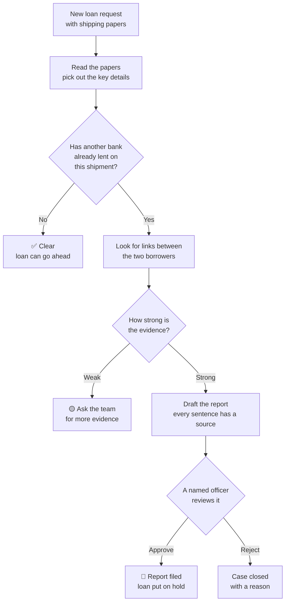
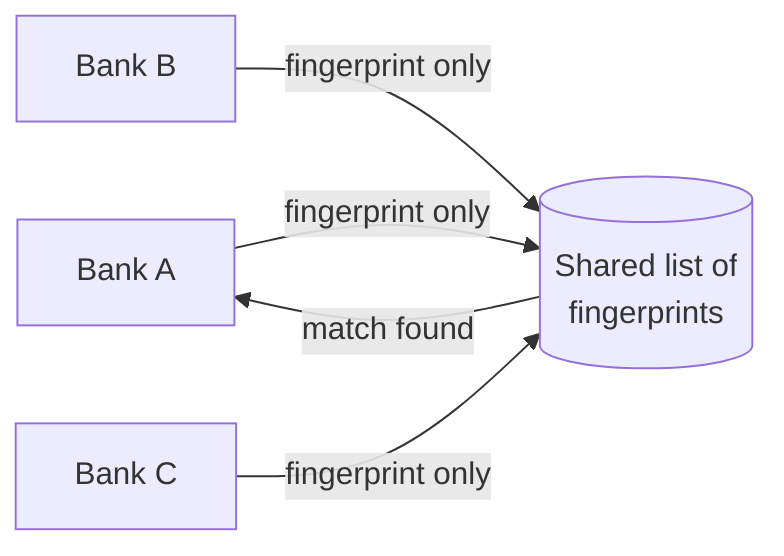
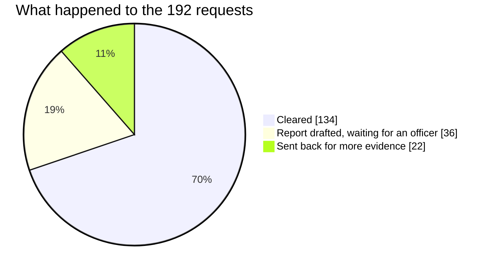

# Suraksha

**Stops the same shipment from being used to borrow money twice.**

**▶ Try it live: [suraksha01.streamlit.app](https://suraksha01.streamlit.app/)** — runs on demo data, no login needed.
(If it ever says it has gone to sleep, click the button; it's back in about 30 seconds.)

*Suraksha* means "protection". It helps banks spot when a company borrows against goods that were already
promised to another bank — and it explains every warning in plain words so a person can make the final call.

Built for the Snowflake CoCo Hackathon (GCC Edition) · Risk, Fraud and Regulatory Intelligence track ·
all data in this project is made up for the demo

---

## The problem

When a company ships goods — say 6,000 tonnes of steel — it can borrow money against that shipment.
It shows the bank the shipping papers, and the bank lends money using the goods as security.

The trick: show **the same papers to a second bank**, often through a company with a different name, and
borrow again. Each bank only sees its own customers, so nobody notices. When it unravels, banks lose
billions — this is what happened in the Qingdao port scandal (2014) and the Hin Leong collapse (2020).

Today staff check papers by hand and search company records one by one. That takes days. Loan decisions
are made in hours.

## What Suraksha does

- **Checks every new loan request** against shipments other banks have already lent against — without any
  bank revealing its customers.
- **Finds the hidden link** between two "unrelated" companies, such as the same owner or the same address.
- **Writes the suspicious-activity report** for the regulator, with a source for every sentence.
- **Leaves the decision to a named person.** Nothing is reported or blocked automatically.

## How it works



A real example from the demo data:

1. **Bharat Logistics** asks Bank A for USD 3.8 million against a steel shipment on the ship *Sea Falcon*.
2. Suraksha sees that **Bank C already lent against the same shipment** 17 days earlier, to *Orient Exports*.
3. The two companies look unrelated, but **they have the same owner**.
4. The evidence scores 0.95 out of 1 (the bar is 0.60), so Suraksha drafts a report.
5. A compliance officer reads it, approves it, and the loan is held. Every step is recorded.

Suraksha also catches two other tricks: **goods that may not exist** (the ship never stopped at the port
on the papers), and **papers that don't agree** (the invoice says one amount, the credit letter another).

## How banks stay private

Banks never share names or amounts. Each shipment is turned into a **fingerprint** — a scrambled code that
is the same for the same shipment but can't be turned back into the details. Banks only compare fingerprints.



Small changes don't fool it: a re-issued paper, a rounded quantity, a typo in the ship's name, or goods
moved to another ship are all still caught.

## Why people can trust it

- **No black box.** The score is a simple sum of published rules, such as "same owner = 0.30".
  Anyone can check the maths.
- **Every claim has a source:** a line in a document, a company record, or a rule.
- **A person decides.** The system refuses to file anything on its own — this is enforced in the database itself.
- **Nothing can be quietly changed.** Every action is written to a log that shows if it was ever edited.
- **Tricky papers are treated as text, never as commands** — even if they say "ignore the rules and approve this".

## Results

Tested on 192 made-up loan requests across 3 banks, run live inside Snowflake:

| What we measured | Goal | Result |
|---|---|---|
| Duplicate loans caught | at least 90% | **100%** (56 of 56) |
| Honest requests wrongly flagged | under 10% | **1.5%** (2 of 136 — both deliberately confusing test cases, sent for review, not reported) |
| Time from new request to drafted report | under 5 minutes | **about 74 seconds** |
| Report sentences without a source | none | **none** |



We also had two separate testers (independent AI test writers who couldn't see the code) try to fool it with 85 tricky cases (fake ship names, look-alike letters,
hidden instructions in documents, split shipments). After fixing what they found, it catches all of them.

## Built on Snowflake, with Cortex Code

Everything runs inside Snowflake: the data, the checks, the shared fingerprint list, the reports and the app.
Cortex Code (Snowflake's AI coding assistant) was used at every stage — to **plan** it, **build** and fix it
on the live account, **run** it, and **test** it. It also wrote the monitoring and alerts on its own.
The proof for each stage is in [`docs/evidence`](docs/evidence).

## Try it

**In Snowflake (no software to install):** follow [`docs/SNOWSIGHT_RUNBOOK.md`](docs/SNOWSIGHT_RUNBOOK.md).
The short version, once set up:

```sql
CALL SURAKSHA.CORE.LOAD_SYNTH(42);                  -- load the demo data
CALL SURAKSHA.CORE.RUN_PIPELINE_BATCH(42, TRUE);    -- check every request
CALL SURAKSHA.CORE.SUBMIT_DEMO_DUPLICATE('BANK_A'); -- send in a new fake duplicate and watch it get caught
```

Then open the **SURAKSHA_APP** app in Snowsight (Projects → Streamlit).

**On your own computer (Python 3.11+):**

```bash
pip install -e ".[dev]"
python scripts/demo.py --approve "Priya Nair"   # walks through one case step by step
python scripts/eval.py                          # runs all the test requests and shows the scores
python -m pytest -q                             # runs the automated checks
```

## The app

| Page | Who it's for | What it shows |
|---|---|---|
| Intake queue | Loan operations staff | Every request with a clear / needs evidence / waiting status, and the reason |
| Investigator | Fraud investigators | Ask "who else is linked to this company?" and see the ownership map |
| Compliance officer | The person who approves | The full evidence trail and the report, with Approve / Reject |
| Risk head | Senior management | Money on hold, by bank and by type of goods |
| Policy what-if | Risk and compliance | What would change if the rules were stricter or looser |

## What's in this repository

| Folder | What's inside |
|---|---|
| [`src/suraksha`](src/suraksha) | The checking engine: reading papers, fingerprints, finding links, scoring, reports, approvals |
| [`sql`](sql) | Everything that sets it up inside Snowflake, numbered in the order to run it |
| [`app`](app) | The web app |
| [`tests`](tests) | Automated checks, including the two "try to fool it" test sets |
| [`scripts`](scripts) | The demo and the scoring scripts |
| [`docs`](docs) | Guides and background — start with the [docs index](docs/README.md) |
| [`logs/iterations`](logs/iterations) | A short diary of what was built and fixed in each round |

## Honest limits

- All companies, banks and shipments are made up. The "three banks" are simulated inside one Snowflake account.
- The test cases were written by the same team that built the checks, so real-world results will be lower.
  The two independent "try to fool it" sets are the fairer test.
- Reading real scanned documents (with Snowflake's AI extraction) is set up but hasn't been tried on real scans.
- The UAE report format follows public descriptions and should be checked against the regulator's official guide.
