# Architecture

## Runtime view

```mermaid
flowchart LR
  subgraph BankA[Bank A account / schema]
    REQ[Financing request + PDFs] --> INT[intake.extract<br/>Cortex AI_EXTRACT in Snowflake<br/>regex parser locally]
    INT --> FP[fingerprint.build_fingerprint<br/>salted SHA-256 keys]
  end
  FP -->|hash-only lookup| CONS[(CONSORTIUM ledger<br/>secure share: keys, qty_band,<br/>borrower_token, pledged_at)]
  FP -->|register own pledge| CONS
  CONS -->|matches| INV[investigator.investigate<br/>registry graph BFS + txns + policy]
  INV --> CONF[confidence.score<br/>deterministic RULE_WEIGHTS]
  CONF -->|LOW| ASK[NEED_MORE_EVIDENCE<br/>concrete asks]
  CONF -->|HIGH| STR[report.draft_str<br/>FIU-IND STR, every sentence cited]
  STR --> CASE[approval.open_case]
  CASE --> UI[Streamlit / Slack]
  UI -->|named officer| DEC[approval.decide]
  DEC --> AUD[(AUDIT_LOG<br/>insert-only, SHA-256 hash chain)]
```

## Design decisions
| Decision | Why |
|---|---|
| Consortium stores only salted hashes (cargo keys + borrower token) | Banks never share names or amounts; PRD privacy requirement |
| Three keys per pledge: `exact`, `cargo` (no B/L no.), `bl` (no qty) + neighbour qty bands | Catches exact copies, reissued B/Ls and rounded quantities while staying hash-only |
| Counterparty resolved by hashing the **public** registry's reg numbers | Investigator can prove links without the other bank revealing its customer |
| Deterministic rule weights (`config.RULE_WEIGHTS`, mirrored in `sql/04_rules.sql`) | G3: no black-box score; every point of score traces to cited evidence |
| LOW confidence → ask, not guess | PRD: "tell me when evidence is weak" |
| Pipeline raises if any STR sentence is uncited | G3 is enforced in code, not by convention |
| `decide()` refuses `system:*` actors | G4: no case filed / hold recommended without a named human |
| Audit = append-only + hash chain | Auditors can replay and detect tampering |
| `Store` protocol with Memory + Snowflake backends | Full pipeline and tests run with zero credentials and almost nothing on device; same code runs on Snowflake |

## Code map
| Path | Role | Owner |
|---|---|---|
| `src/suraksha/models.py` | shared dataclasses | master |
| `src/suraksha/store/{base,memory,snowflake}.py` | storage contract + backends | master / snowflake-infra |
| `src/suraksha/agents/intake.py`, `fingerprint.py` | extraction, hashing, matching | match-engine |
| `src/suraksha/agents/investigator.py`, `linkage.py`, `confidence.py` | graph, Q&A, rules | investigator |
| `src/suraksha/agents/report.py`, `approval.py`, `integrations/slack.py` | STR, cases, audit, Slack | report-approval |
| `src/suraksha/integrations/cortex.py`, `sql/` | Snowflake Cortex + DDL | snowflake-infra |
| `src/suraksha/synth/` | synthetic banks, registry, docs, seeded cases | synth-data |
| `src/suraksha/pipeline.py` | orchestrator | master |
| `scripts/eval.py`, `tests/e2e/` | goal verification | master |
