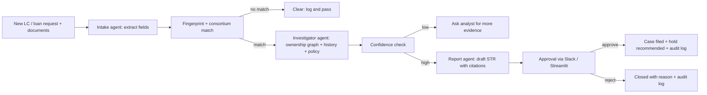

# Suraksha — PRD (Sep 26, 2026)

**Hackathon:** Snowflake CoCo CLI Hackathon (GCC Edition) · **Track:** Risk, Fraud and Regulatory Intelligence Copilot
**Built with:** Snowflake + CoCo across plan, build, run and test.

## Overview
Suraksha catches trade-finance duplicate financing before the money leaves the bank. It flags when the same
cargo is pledged to more than one lender, proves the link between "unrelated" borrowers, and hands a compliance
officer an audit-ready finding to approve.

## Problem
In documentary trade finance, a borrower can present the same bill of lading, warehouse receipt or invoice to
several banks and draw a loan from each. Shell companies with different names hide that the borrowers share owners
or directors. Each bank sees only its own book, so no single bank can spot the duplicate. (Qingdao 2014, Hin Leong 2020.)
Today analysts check documents by hand, search registries one company at a time, and write findings in Word.
An investigation takes days; a disbursement decision often takes hours.

## Goals (acceptance criteria)
| # | Goal | Measured by |
|---|------|-------------|
| G1 | Catch duplicates before disbursement: ≥90% detection of seeded duplicate cases, FPR <10% | `scripts/eval.py` on synthetic set |
| G2 | Alert → drafted, evidence-linked finding in <5 min | `elapsed_ms` per request in eval |
| G3 | Every answer explainable: each finding cites documents, registry rows, policy clauses; no black-box score | `validate_citations` = [] for every STR; rules are deterministic weights in `config.RULE_WEIGHTS` |
| G4 | Humans stay in control: no case filed / hold without a named officer's approval | `approval.decide` rejects non-human actors; e2e test |
| G5 | CoCo in every phase | `docs/COCO_USAGE.md` + screenshots |

## Non-goals
Real bank/customer data · live multi-bank consortium (3 banks simulated on one Snowflake account) · live registry
integration (synthetic registry stands in for MCA21/OpenCorporates) · automatic loan blocking (Suraksha recommends a hold) ·
card/UPI/retail fraud.

## Personas & stories
- **Trade-ops analyst** — every new request checked against other banks' pledged cargo; clear reason when held.
- **Financial-crime investigator** — ask "who else is linked to Company B?" in plain English; see ownership path; be told when evidence is weak.
- **Compliance officer (MLRO)** — drafted STR with every claim cited; approve/reject from Slack; immutable log of who did what.
- **Risk head** — daily summary of flagged exposure.

## Solution: signal → evidence → finding

1. **Intake** — Cortex AI extraction pulls B/L no., vessel, voyage, ports, commodity, quantity, value, dates, parties.
2. **Fingerprint & match** — salted hash of cargo identity checked against a consortium table shared via Snowflake secure data sharing. Hashes only, never names or amounts. Fuzzy matching for reissued B/L / rounded quantity.
3. **Investigate** — ownership graph walk (companies, directors, shareholders, addresses, phones), transaction history, policy sections.
4. **Confidence check** — deterministic SQL rules (exact hash, shared UBO, shared director, same address, timing overlap). Below threshold → ask for more evidence.
5. **Report** — STR in FIU-IND structure; every sentence links to its source row or document page.
6. **Approve & act** — approve/reject in Slack or Streamlit; approval creates case, recommends hold, writes immutable audit record.
